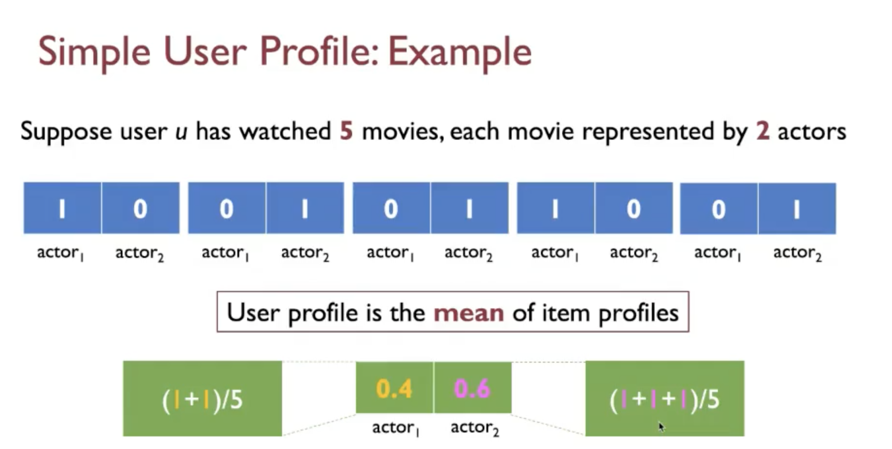
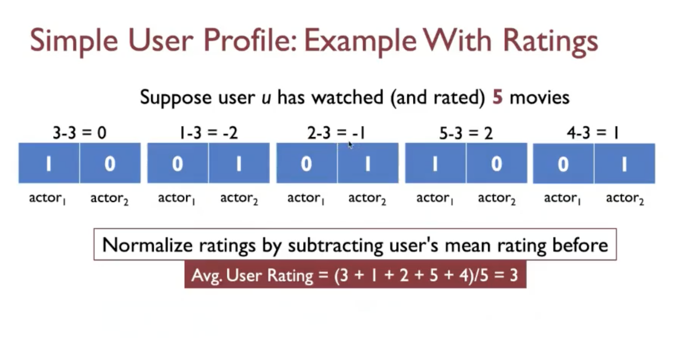
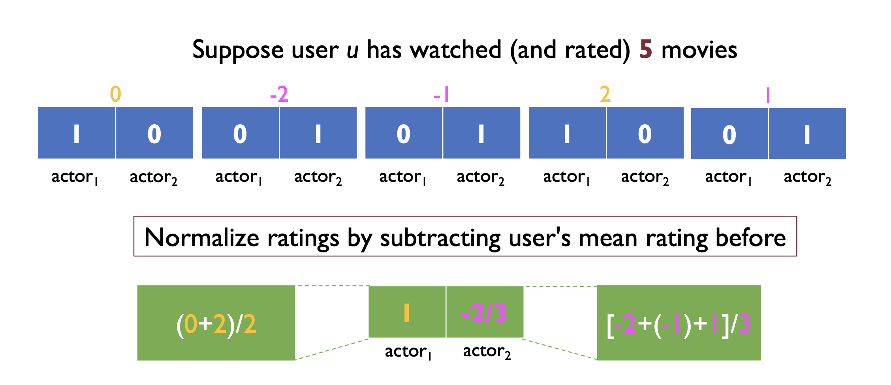
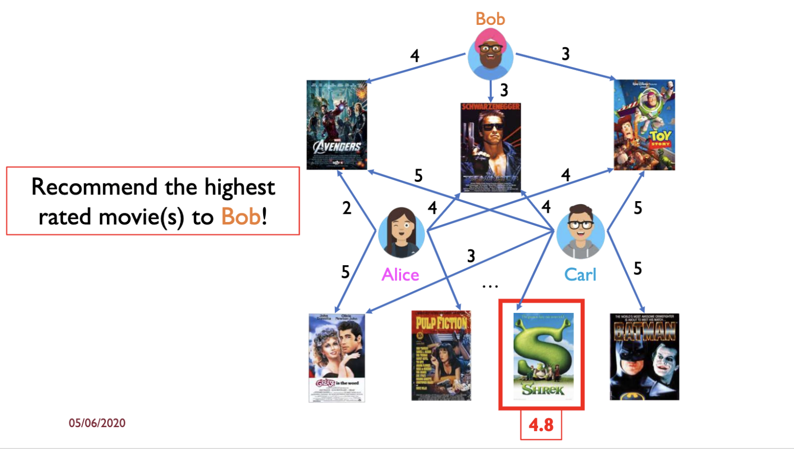
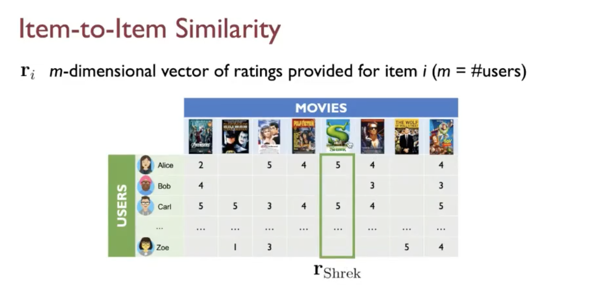
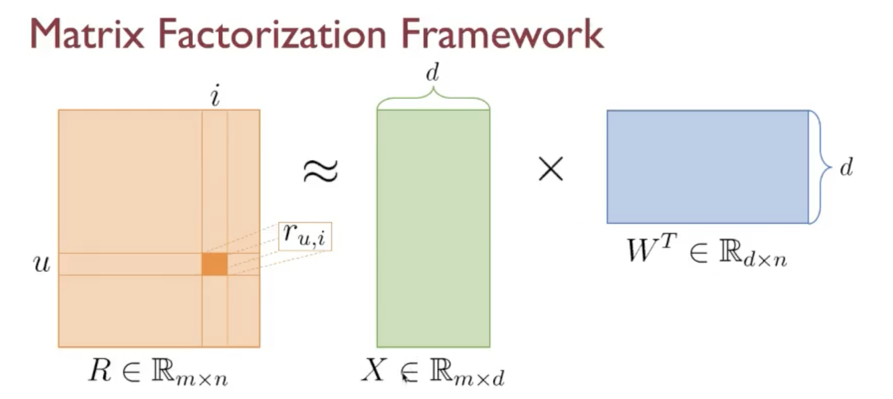
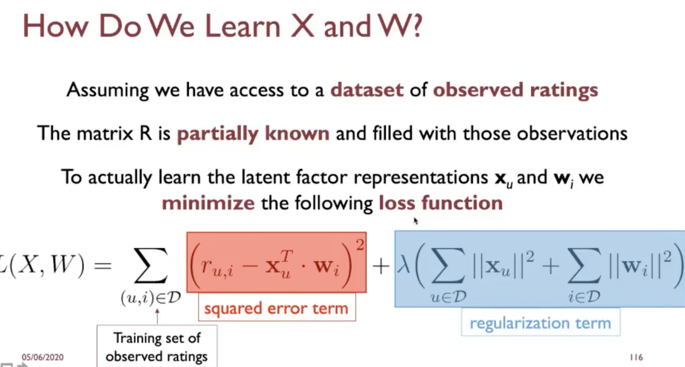
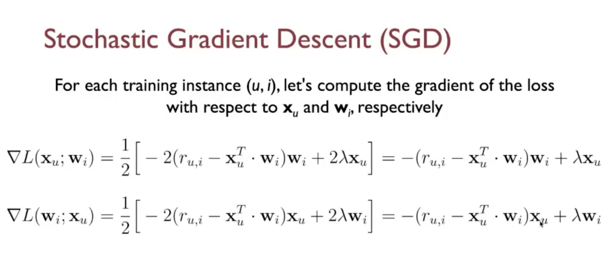
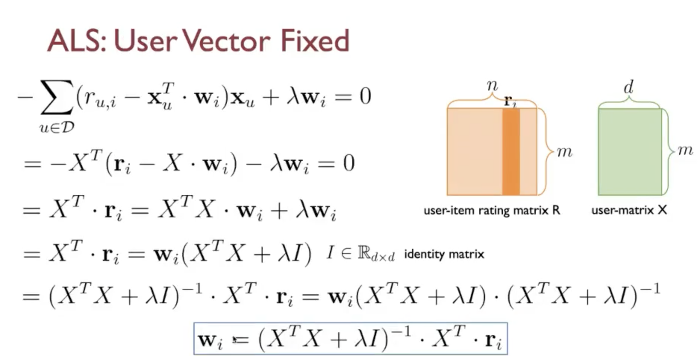
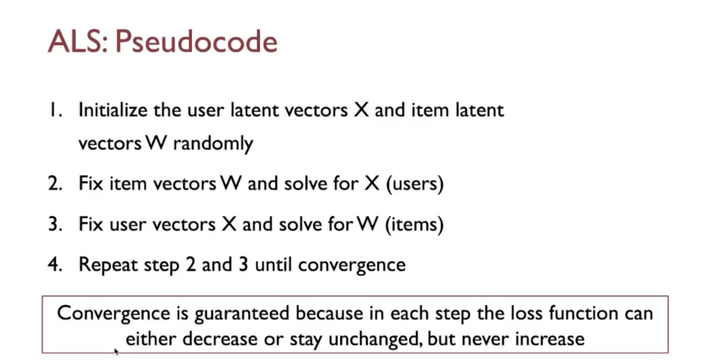

# Recommandation system

The idea is to match consumers with the most appropriate products/services is key to enhancing user satisfaction and loyalty.

## **R.S. formalism** 

- Set of users $$ U = \{u_1\dots u_m\} $$

- Set of items $$ I = \{i_1\dots i_n\} $$

- Utility function (user-item matrix) $$ r: U \times I \to R $$

- $$ R \subseteq \R $$, it defines the set of **ratings**, $$R$$is made by either discrete ratings (i.e. from 1 to 5 stars) or continuous values.

## The utility functions

You create a matrix made by **m rows (number of users)** and  **n cols (number of items)** , each matrix's entries rappresent the rating give to a specific items by a specific user. Howewer this matrix tends to be very sparse, there are lot of missing data, not every users rates every items.

## The 3 Key problems for a r.s.

- **1. Data collection**, how to populate the matrix
- **2. Rating prediction**, fill the gap w.r.t the missing rating
- **3. R.S. eval**, measure the perfomance of recommender methods

## 1. Data collection

Two ways to do it:

- **Explicit**, ask people to rate items;
- **Implicit**, find out using user's behaviour i.e. the user queries and the click etc..., but the user doesn't explicit give a value to the item

## 2. Rating prediction

Two main issues:

- The matrix is very spare;
- Cold start, the new users cannot have an history, and the system cannot have any specific information about him to give a recomandation.

## 3. R.S. eval

- RMSE
- Precision, Recall at K
- Personalizzation
- Serendipity

# **Recommendation strategies**

- 1. Content-based filtering
- 2. Collaborative filtering
- 3. Hybrid filtering

## 1. Content based filtering

Recommend items to user u similiar to previous items rated highly by u.
Given the **item profiles**, the description of am item, we want to be able to create a **user profiles**, it says what the users likes.
After do that we want combine **user profiles** with the item trough all catalog.

- **item profiles**, for each item i create a profile, i.e. a set of featues, <u>that better rappresent the specific item</u>, this is a f.e. taks, extract features from your items

  > Let's take an item as article, the possible profile could be an array of word for each article, and this array contains the a score for every word in the arrays.

  The idea is not to use the ratings, but create metadata using our domain knowlodge, it is a kind of f.e. step.
  
  ## User profiles strategies

Once you've the item profiles, for each user create a user profile, based him/her rated items profile. 

- **the simplest solution** is to take the average through all items  rated by him/her, this approach is not fair, all items are treated equally  

  
  
- Now let consider the rating for each items, for semplicity we standardise the ratings. i.ei item 1 has 3 of rating, 3-3(the mean)

  

  

The slides above shows a list of item profiles, which are rappresentad using features actor1, actor2, up to every cell there's the scaled rating for that moovie.

> **The user profile is the green rectangle, which is the mean of the rating across the 5 items profile previously chosen.**  

## 	Building predictions, content-based filtering

- Given user profile **u** we can estimate the missing entries of the utility matrix for u;

- For each item **unrated** by **u**, compute the cosine sim (or another) between u and the corresponding item profile vectors;

- Finally, we pick the top-k items with **the highest similarity score**, and we reccomend those to u.
  $$
  A^0 = \empty \\
  A^1 = argmax_{i}\{ sim(u,i): i \in I- I_{u} -A^0\}\\
  A^2 = argmax_{i}\{ sim(u,i): i \in I- I_{u} -A^0-A^1\}\\
  
  R_{u,k} = \bigcup\limits_{j=1}^{k} A^j
  $$
  

  ## PROs

- No need for data on other users: only the user and the items rated by her/him are needed;

- no **item cold start** problem, when the item is new or unpopular, it can still be reccomended to users with highest profile similarity;

- you have to perfom a sort of feature engineerings strategies, and  it's very human understable.

  

  ## CONs

- Find the best featues which express well the items;

- unable to find the quality judgments of other users;

- **user cold start**, for new users, if the user hasn't rated any items, then there's no user profile;

- overspecializzation, never reccomends items outside user's prfile;

  

## **2. Collaborative filtering**

Recommend items to user *u* based on preferences of other users **similar** to *u*

> Here we aren't using any sort of f.e. techniques, we don't need any effort in order to extract information

3 main approaches

- 2.1. Neighbourhood-based

### 2.1. Neighbourhood-based

Compute the relationship between useres or items, the first one evaluates a user's preference for an item based on ratings of "neighboring" users for that item; whereas item-based evaluate preference on rating of "neighboring" items by the same user 

#### **2.1.1. User based Neigh.**

​	Given a user *u* and an item *i* not rated by *u*,we want estimate r(u,i), takes the set $$ \{u': u' \ne u \}$$, who have already rated the item *i*, extract a subest of k neighbours of *u*

> K-neigh of *u* is found on the basis of the similarity between user ratings without the need of explicit user profiles

In theory, rating prediction *r(u,i)* could be defined on any *i* not rated by *u*, in pratice we are interessed only in estimating *r(u,i)* for those *i* which have been rated by the u's k-neigh.

> Hint: if a user *v* is not in the k-n of *u* then very likely *u* will not be interested in any item that only *v* has rated.

Bob has Alice and Carl as your neigh., according to the mean compute through all moovies watched by Alice and Carl **user-based neigh.** reccommend Sherek which is the highest.

#### 	User to user similarity

Finding u' that are ''similar'' to u, **remark**, we are not building any counter-based user/item profil.

> Intuitevely, 2 users u and v, are similar to each other if their ratings(of items) are similar

Each user can be rappresent by him rating vectors, using it we can compute any sort of similarity.

$$ r_u $$ n-dimensional vector of ratings made by *u*, (n= # items), now the users is rappresented by a vector where for each dimension we can find an item's rating

##### 			**2.1.2.1 Jaccard similarity**

$$
sim(u,v) = J(r_u,r_v) = \frac{|r_u \cap r_v|}{|r_u \cup r_v|}
$$

**2.1.2.2  Cosine similarity**
$$
sim(u,v) = cosine(r_u,r_v) = \frac{|r_u \cdot r_v|}{||r_u||\cdot ||r_v||}
$$

> **PROBLEM** missing rating treated as 0s and have negative effect

A solution is to use **PEARSON CORRELATION** which is the cosine plus normalization

Given the similarity measures you can compute the set of the top k-neigh.

Let take the top-k most ''similar'' users to *u*: $$ U^k $$ (u's neigh.), and $$ I^k $$ as the set of items rated by 's neigh.

Two possible way to aggregating neighboors ratings

- $$ r_{u,i} =  \frac{1}{k}\sum\limits_{v \in U^k} r_{v,i} $$ the plain average, this strategies doesn't take account of different sim between users;

- $$r_{u,i} =  \frac{\sum\limits_{v \in U^k}sim(u,v) \cdot r{v,i}}{\sum\limits_{v \in U^k}sim(u,v)} $$ weighted average, you put weight for each k neigh.

#### User-baed C.F. issues

- Sparsity, system compute poorly when they had many items but comparitevly few ratings

- Efficency, compute sim between pairs or users

- Aging, user profiles changed quicly the entire system 

  

#### 2.2. Item Based CF, Neighborhood

Introduced to overcome the 3 issues showed above, given an user *u* an item *i* not rated by *u*, we want to estimate *r(u,i)*, we take the set of the items rated by *u* and compute the k-neigh. items.

> **k-neigh is found on the basis of the similarity between items without the need of explicit item's content or metadata** 

The key trick is to find the way to compute the similarity between **items**, this time rather than $$ r_u$$ we compute $$ r_i$$ m-dimensional vector of ratings provided for item i (m = # of users)

**Use the same score-similarity introduced and rating the prediction using the same  before** 

As a conclusion of the Model-based CF, we state that is most expensive find the k most similar users(items); the computation is too expensive to do online; finding the k most similar users/items should be pre-computed(offline)

> We have to deal with the curse of the dimensionality, since the k.n.n is rappresented in high dimensions

The item based approach the generated vector is less sparse and suffer less of anging 

### 2.2 Latent Factor CF

Tries to reduce the vectors dimension BOTH for users and items, with a number of hidden features inferred from observed ratings

We have d-dimensional space (which don't know) which contains d hidden feature, user-item interactions are defined as inner products in that space

 let $$ x_u \in \R^d $$ d-dimensinal vector representing user *u* and $$ w_i \in \R^d $$  for the items (same as the users)

- Each $$ x_u \in \R^d $$ measures the extent of interest user *u* has in items exhibiting the (latent) k-th factor

- $$ w_i \in \R^d $$  measures the extent to which the item *i* has the k-factor, how much the item is related to this latent factor

  **REMARK: WE DON'T WHAT THESE FEATURE ARE, HENCE WE DON'T KNOW WHAT THE NUMBER OF EACH D-DIMENSION RAPPRESENTED**

Features interpreatation:

In the case of the users vector each components tell us how much this user like this item

In the case of the items vector each component tell us how much this item is close to this features

> We don't know what these features are nor do we have to determine them beforehand

We don't know what this numbers means!
$$
r(u,i) = r_{u,i} \\
r'_{u,i} = x
$$
We want to learn the latent user vector and latent item vector

$$ 	X$$ is the user's matrix which is the embedded of the user

$$ W^T $$ is the item's matrix which is the embedded of the item

We want estimate $$R$$, which is **partially known**, using this fact we are able to train a model such that allow us to create a training samples (the R instances known) in order to predict not known samples of R, obviusly we define an opt. problem

​	

### Two main way to comput best parameters 

- SGD

if the dimension of R is very high doesn't work well

- ALS

  The original obj function is non-convex, ALS operates in alternately fixing one latent vector and updating the other one, to do that, when one latent vector is fied, the obj, becomes quadratic and therefore covex! **Hence we could apply the OLS techniques**.

OLS w.r.t the item latent vector

In general SGD is easier and faster than ALS, but ALS with ALS we could paralellize the computation and if the training set is dense (enough rating for each istances) and hence SGD is computational infeasible

img 

img

img

CF suffer 3 main problem:

- cold start for a new user/item entering the system there is not enough data to make recommendations;
- Scalability, whenever you have lot of data, the computaitonal power is too high;
- Sparsity.